# Spring Boot RESTful service
A basic RESTful CRUD API with Spring Boot.

`Initiated at July 9, 2021`

## Table of Contents
1. [Description](#description)
2. [Technologies](#technologies)
3. [Development](#development)
    - [Useful links](#useful-links)
    - [Database initialization](#database-initialization)
    - [API calls](#api-calls)
4. [CI/CD](#cicd)
    - [Dockerfile](#dockerfile)
    - [Create AWS Elastic Beanstalk app](#create-aws-elastic-beanstalk-app)
    - [Create an IAM non-root user](#create-an-iam-non-root-user)
    - [Create AWS S3 Bucket](#...)
    - [Add Environment variables in Travis-CI](#...)
    - [Travis yaml](#travis-yaml)    
5. [Improvements](#improvements)
6. [Conclusion](#conclusion)

<a name="description"></a>
## Description
Build a Spring Boot RESTful CRUD API example with Maven that use Spring Data JPA to interact with a H2 database.
Here we cover the next topics:
* Configure Spring Data, JPA, Hibernate to work with Database
* Define Data Models and Repository interfaces
* Create Spring RESTful Controller to process HTTP requests
* Use Spring Data JPA to interact with H2 Database

<a name="technologies"></a>
## Technologies
  | Name                        | Version     | Notes                                             |
  |-----------------------------|-------------|---------------------------------------------------|
  | Java JDK                    | 11.0.11     |                                                   |
  | Spring Boot                 | 2.5.2       | Spring Web MVC, Spring Data JPA                   |
  | H2 Database                 | 1.4.200     | 2019-10-14                                        |
  | Maven                       | 3.8.1       |                                                   |

<a name="development"></a>
## Development

<a name="useful-links"></a>
### **Useful links**
H2 Database console:
*http://192.168.56.105:8080/h2-console*

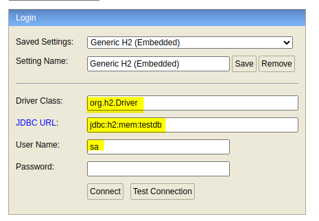

API documentation:
*http://192.168.56.105:8080/swagger-ui-custom.html*

OpenAPI specification:
*http://192.168.56.105:8080/api-docs.yaml*


<a name="database-initialization"></a>
### **Database initialization**
```sql
INSERT INTO TUTORIALS (ID, DESCRIPTION, PUBLISHED, TITLE) VALUES
  (1, 'Desc for Tut#1', FALSE, 'Spring Boot Tut#1'),
  (2, 'Tut#2 Description', TRUE, 'Spring Data JPA Tut#2'),
  (3, 'Desc for Tut#3', TRUE, 'H2 Database Tut#3'),
  (4, 'Tut#4 Description', FALSE, 'Spring Boot CRUD Tut#4'),
  (5, 'Desc for Tut#5', TRUE, 'Spring Boot JPA H2 example Tut#5'),
  (6, 'Tut#6 Description', FALSE, 'Spring Boot Tut#6'),
  (7, 'Tut#7 Description', TRUE, 'Spring Data Tut#7'),
  (8, 'Tut#8 Description', TRUE, 'MySQL Database Tut#8'),
  (9, 'Tut#9 Description', FALSE, 'Hibernate Tut#9'),
  (10, 'Tut#10 Description', FALSE, 'Spring Cloud Tut#10'),
  (11, 'Tut#11 Description', TRUE, 'Microservices Tut#11'),
  (12, 'Tut#12 Description', FALSE, 'MongoDB Database Tut#12');
ALTER SEQUENCE HIBERNATE_SEQUENCE restart with 13;
```

<a name="api-calls"></a>
###  **API calls**
<u>Add new tutorial:</u>

*POST 192.168.56.105:8080/api/tutorials*
```json
{
  "title": "Spring Data JPA Tut#13",
  "description": "Tut#13 Description"
}
```

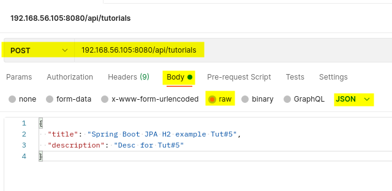

---

<u>Update tutorial:</u>

*PUT 192.168.56.105:8080/api/tutorials/4*

```json
{
  "title": "Spring Boot CRUD Tut#4",
  "description": "Tut#4 Description",
  "published": true
}
```
---

<u>Get tutorial:</u>

*GET 192.168.56.105:8080/api/tutorials/4*

---

<u>Get all tutorials:</u>

*GET 192.168.56.105:8080/api/tutorials*

---

<u>Get tutorials published:</u>

*GET 192.168.56.105:8080/api/tutorials/published*

---

<u>Get tutorial by title:</u>

*GET 192.168.56.105:8080/api/tutorials?title=ot*

---

<u>Get all tutorials paged:</u>

*GET 192.168.56.105:8080/api/page/tutorials?page=2&size=5*

---

<u>Get all tutorials paged and published:</u>

*GET 192.168.56.105:8080/api/page/tutorials/published*

---

<u>Delete a tutorial:</u>

*DELETE 192.168.56.105:8080/api/tutorials/4*

---

<u>Get API info:</u>

*POST 192.168.56.105:8080/api/info*
```json
{
    "name": "demo",
    "version": "0.0.1-SNAPSHOT",
    "timestamp": "13-07-2021 12:33"
}
```

<a name="cicd"></a>
## CI/CD

<a name="dockerfile"></a>
### **Dockerfile**

```dockerfile
FROM openjdk:11 as build
WORKDIR /workspace/app

COPY mvnw .
COPY .mvn .mvn
COPY pom.xml .
COPY src src

RUN ./mvnw install -DskipTests
RUN mkdir -p target/dependency; cd target/dependency; jar -xf ../*.jar

FROM openjdk:11
VOLUME /tmp
ARG DEPENDENCY=/workspace/app/target/dependency
COPY --from=build ${DEPENDENCY}/BOOT-INF/lib /app/lib
COPY --from=build ${DEPENDENCY}/META-INF /app/META-INF
COPY --from=build ${DEPENDENCY}/BOOT-INF/classes /app
ENTRYPOINT ["java","-cp","/app:/app/lib/*","com.example.demo.DemoApplication"]
```

<a name="create-aws-elastic-beanstalk-app"></a>
### **Create AWS Elastic Beanstalk app**

<u>AWS Beanstalk console:</u>

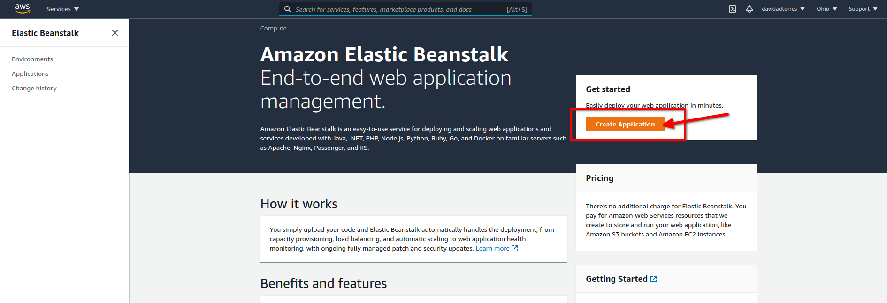

<u>Configure as Docker app:</u>

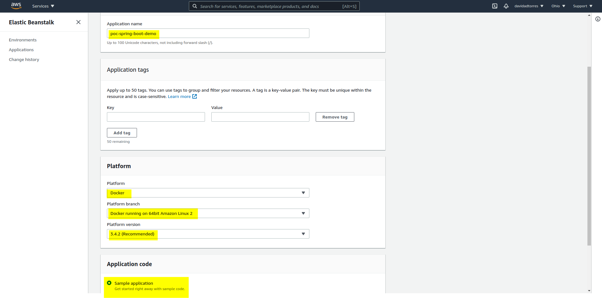

<u>Create app:</u>

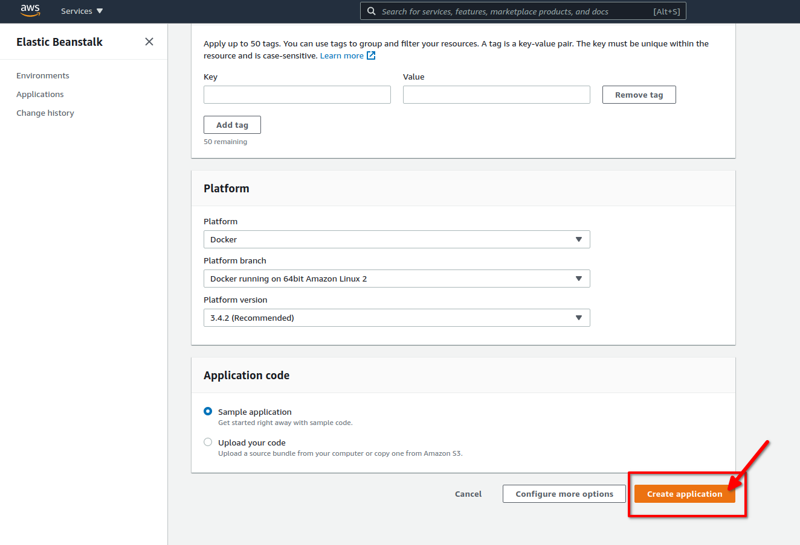

<u>Creation process:</u>

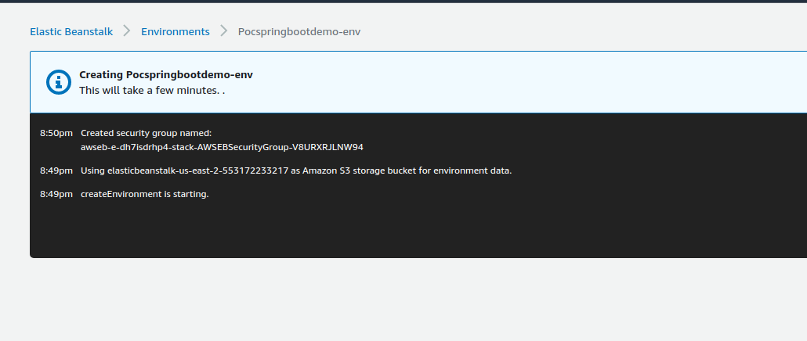

<u>Creation successfully:</u>

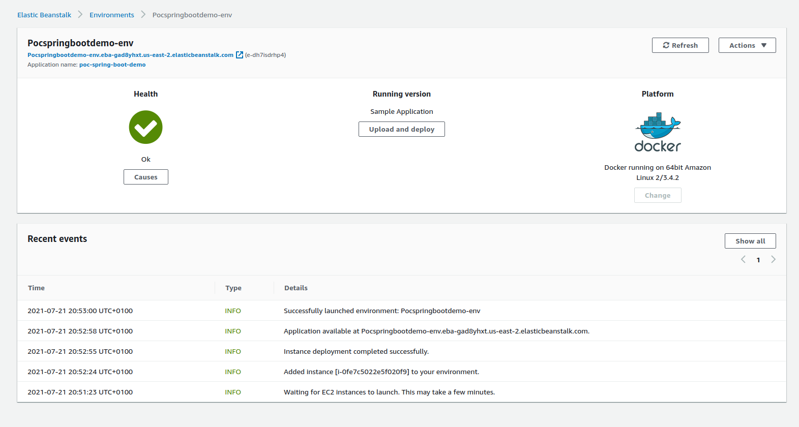


<a name="create-an-iam-non-root-user"></a>
### **Create an IAM non-root user**

<u>Create a user under IAM service:</u>

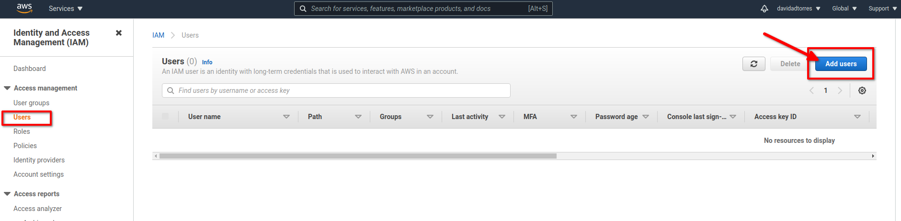

<u>Configure user:</u>

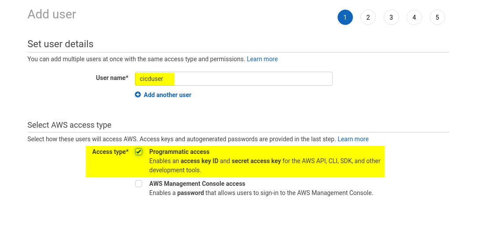

<u>Attach required policies:</u>

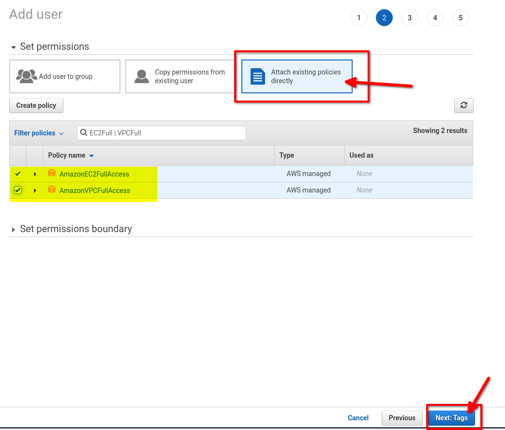

<u>Create user without tags:</u>

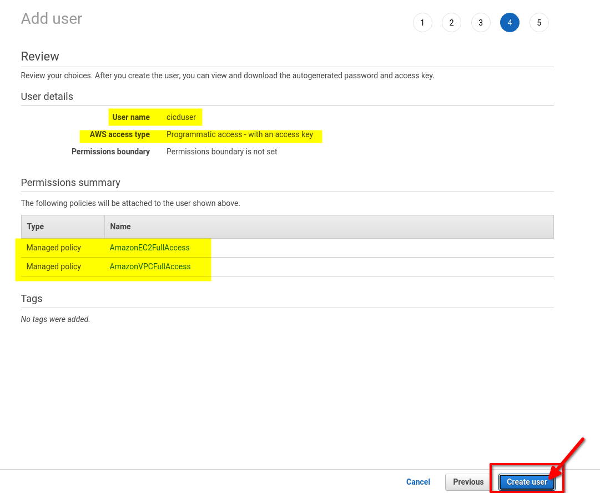

<u>Keep safe credentials (Access key ID and Secret access key):</u>

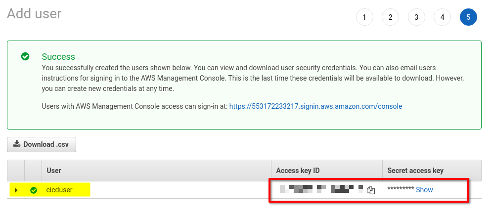

<a name="travis-yaml"></a>
### **Travis yaml**

```yaml
language: java
jdk:
  - openjdk11
os:
  - linux
services:
  - docker
before_install:
  - docker build . -t poc-spring-boot-demo:local
```

<a name="improvements"></a>
## Improvements
No improvements defined.

<a name="conclusion"></a>
## Conclusion
Here, we’ve built a basic RESTful CRUD API using Spring Boot, Spring Data JPA and H2 Database.
